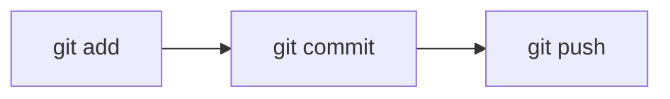

# **GitHub Tutorial**


## Description
GitHub is a web-based platform for version control and collaboration that allows developers to host and manage their code in a central repository. It helps track changes to files and facilitates collaboration with other developers in real-time. GitHub uses **Git** as a version control system, making it easier to manage code changes, revert to previous versions, and share work with others.

- GitHub is built on top of Git, a powerful version control tool used in software development.
- GitHub provides a web interface for managing Git repositories, enabling collaboration and version control with tools such as pull requests, issues, and project boards.
- GitHub enables developers to collaborate on projects from anywhere by creating remote repositories and syncing them with their local repositories.

## Git Commands

### **Most used Git commands**

Let’s first take a look at the flow of pushing updated code to the central repository:



Here’s the basic flow:
1. **Add changes** to the staging area.
2. **Commit** the changes with a message describing what was modified.
3. **Push** the changes to a remote repository (e.g., GitHub).

### 1. Add Changes

#### Command:
```bash
git add .
```
This command stages all changes in the current directory. The dot (`.`) refers to the current directory, and it tells Git to add all modified, new, or deleted files in the directory to the staging area.

If you want to add a specific file, you can do it by:
```bash
git add filename.py
```

#### Explanation:
- `git add .`: Adds all changes (new files, modifications, deletions) in the directory.
- You can also specify individual files to add specific changes.

### 2. Commit Changes

#### Command:
```bash
git commit -m "Your commit message"
```

#### Explanation:
- `git commit`: Takes the changes you’ve staged with `git add` and saves them to your local repository with a descriptive message.
- **Commit message**: A short, meaningful message describing what has been changed in this commit. Example: `"Fix bug in user authentication"`.

To see your commit history, use:
```bash
git log
```

This will display all previous commits with details like author, date, and commit message.

### 3. Push Changes to GitHub

#### Command:
```bash
git push origin main
```

#### Explanation:
- `git push`: Sends the changes (committed locally) to the remote repository (GitHub).
- `origin`: Refers to the default name for your remote repository.
- `main`: Refers to the name of the branch you’re pushing to (commonly `main` or `master`).

> **Note**: If your repository is new and hasn’t been connected to GitHub yet, you may need to set the remote URL first. Use the following command:
```bash
git remote add origin https://github.com/yourusername/yourrepository.git
```

### 4. Pull Changes from GitHub

#### Command:
```bash
git pull origin main
```

#### Explanation:
- `git pull`: Fetches the latest changes from the remote repository and merges them with your local repository.
- `origin main`: Refers to pulling changes from the `main` branch of the `origin` remote repository.

> **Note**: You should always pull before starting new work to ensure your local repository is up-to-date.

### 5. Create a New Branch

#### Command:
```bash
git checkout -b feature-branch
```

#### Explanation:
- `git checkout -b feature-branch`: Creates a new branch called `feature-branch` and switches to it.
- Branches are useful for working on different features or bug fixes independently without affecting the `main` branch.

### 6. Merge Branches

#### Command:
```bash
git merge feature-branch
```

#### Explanation:
- `git merge`: Merges changes from a different branch (in this case, `feature-branch`) into the branch you are currently working on (e.g., `main`).

### 7. Clone a Repository

If you want to copy a repository from GitHub to your local machine:

#### Command:
```bash
git clone https://github.com/username/repository.git
```

#### Explanation:
- `git clone`: Copies the repository to your local machine, including all files and history.

---

## GitHub Features

### 1. **Forking a Repository**
- Forking is used to create a personal copy of someone else’s repository on GitHub. This is common in open-source projects where contributors fork the repository, make changes, and then submit those changes via a pull request.

#### Steps:
1. Go to the repository page on GitHub.
2. Click on the **Fork** button at the top-right of the page.
3. This creates a personal copy of the repository under your GitHub account.

### 2. **Creating a Pull Request (PR)**
- A Pull Request is a way to propose changes to a repository. You create a PR to notify the repository owners about your changes and request them to merge it into their codebase.

#### Steps:
1. Push your branch with changes to GitHub.
2. Go to your repository on GitHub.
3. Click on **Compare & Pull Request**.
4. Write a meaningful description of what you’ve changed and click **Create Pull Request**.

### 3. **Issues**
- GitHub Issues are used to track bugs, tasks, or discussions about a repository.

#### Steps:
1. Navigate to the **Issues** tab of a repository.
2. Click on **New Issue**.
3. Fill in the title and description, and then click **Submit new issue**.

### 4. **GitHub Actions**
- GitHub Actions helps you automate workflows for continuous integration and continuous delivery (CI/CD). You can automate tasks like testing your code, deploying to servers, etc.

---

## Conclusion

With GitHub, you can easily collaborate with others and manage your code efficiently. By using basic Git commands like `git add`, `git commit`, and `git push`, you can handle version control on your local machine and synchronize it with a remote repository hosted on GitHub. Whether you're working on personal projects or contributing to open-source, mastering Git and GitHub will make your development process much more organized and streamlined.

